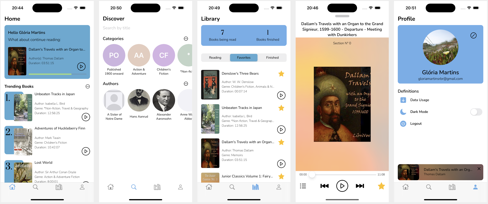
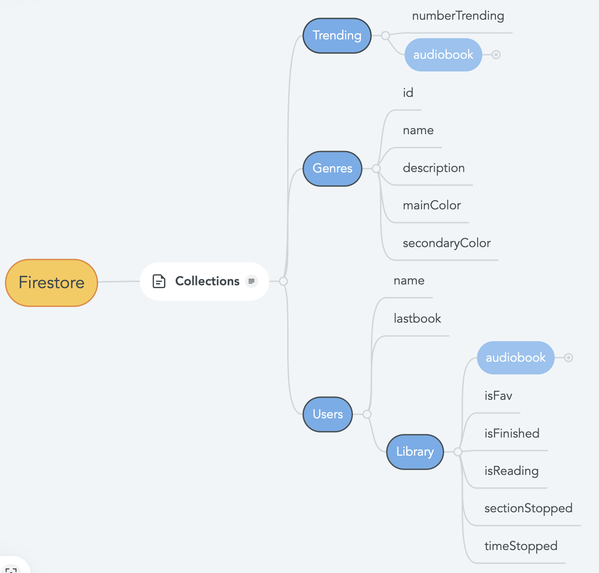
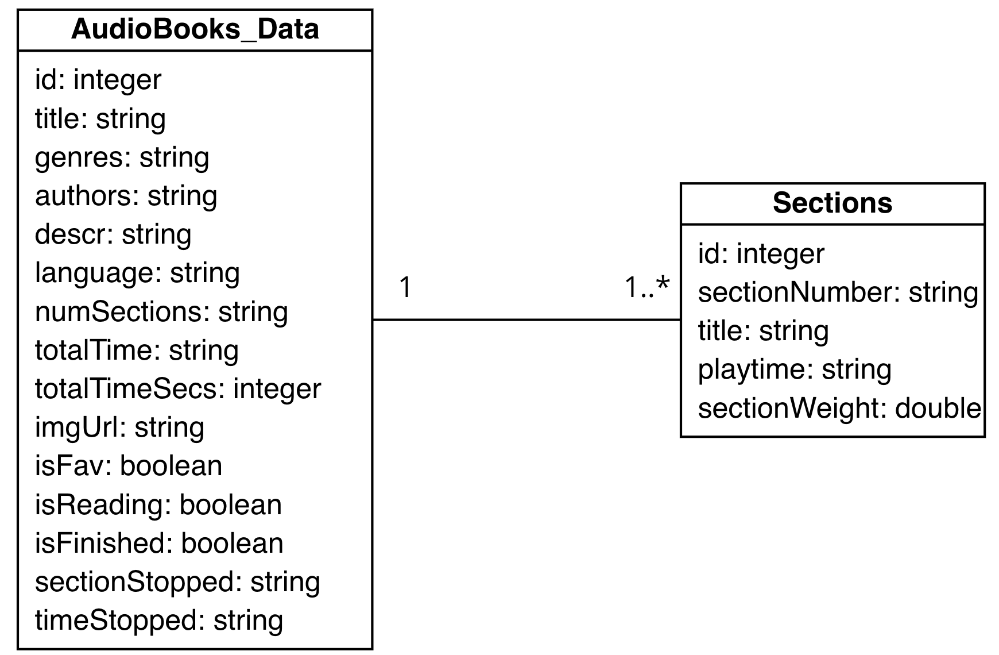

# Narrativia - An iOS App to listen audiobooks using LibriVox API
---    

## Summary
This project was built during an intership, as a course completion, by two developers: Gloria Martins and Leandro Silva, both technicians in Mobile Applications. The purpose of the developing this application was to provide the students, by practicing, how to develop in the iOS platform.

## Introduction
The "Narrativia" app is **free to use** and includes the main functions for consuming audiobooks, such as:
* Offers a vast collection of audiobooks in more than a hundred (100) languages.
* Allows the user to have acess to their account thorught different devices and use the app without connection.
* Reproduce tracks while navigating and in offline mode, if the audiobook was previous downloaded.

This app was designed to adress all the needs present in the market, with "the plus of" an user-friendly interface.




## API LibriVox and Swagger
The main content presented on the app are provided by LibriVox API, a REST API, which contains three endpoints available for developers to integrate the audiobooks into their apps.
1. Returns the audiobooks 
2. Returns the track of an specific audiobook
3. Returns the books of an specific author 

However due the quantity of data in each object, as represented below, and aiming for easy access and management of data, we opted to document the API using Swagger in conjuction with Open API specifications.

Example: Request GET audiobooks 
``` https://librivox.org/api/feed/audiobooks?format=json&extended=1'``` 

Response:
```
{
  "books": [
    {
      "id": "string",
      "title": "string",
      "description": "string",
      "genres": [
        {
          "id": "string",
          "name": "string"
        }
      ],
      "authors": [
        {
          "id": "string",
          "first_name": "string",
          "last_name": "string"
        }
      ],
      "num_sections": "string",
      "sections": [
        {
          "id": "string",
          "section_number": "string",
          "title": "string",
          "listen_url": "string",
          "language": "string",
          "playtime": "string",
          "file_name": "string",
          "readers": [
            {
              "reader_id": "string",
              "display_name": "string"
            }
          ],
          "genres": [
            {
              "id": "string",
              "name": "string"
            }
          ]
        }
      ],
      "language": "string",
      "url_zip_file": "string",
      "url_librivox": "string",
      "url_project": "string",
      "url_rss": "string",
      "totaltime": "string",
      "totaltimesecs": 0
    }
  ]
}
```
By creating the models on Swagger, the client code is easily generated and then embbed into the code. Below there's and example of how to call the API from Swift.
```
DefaultAPI.audiobooksTitletitleGet(title: text, format: "json", extended: 1) { [self] data, error in
[...]
}
```

## Database Schemas
The "Narrativia" is populated by the API, but to enhance the user experience and enable offline access, some data must be stored. Therefore, the apps utilizes two different database schemas:

#### Firestore
Exclusively used to stored support content related to genres obtained from API and personal data.
The genre information stored allows the search for audiobooks according to a genres, and the personal data guarantee the access multi-devices.



#### CoreData
Utilized for local data persistance, enabling offline mode to function effetivaly. The CoreData data is updated everytime the app is started - with a stable connection - and when occurs some alteration on the remote database, ensuring a synchronism between both schemas.



**In case of offline updates, the sync algorithm stays effectivly as a result of the usage of Firebase Persistance**

## Player
The Player, core of application, can be access through the function "goToPlayer", which verifies if the audiobook's file is downloaded, if it isn't, the user is automatically directed foward to the download screen. If the audiobooks is already on the File Manager, the app presents the PlayerVC and the audiobook starts playing.

`goToPlayer(book: book!, parentVC: self)`

```
/// Opens player or starts download
/// - Parameters:
///   - book: book to be played. Can be a Swagger or a CoreData object 
///   - parentVC: current viewController
func goToPlayer(book: PlayableItemProtocol, parentVC: UIViewController) {
    guard let id = book._id else{return}
    if !checkIfFileExists(book_id: id) {
    //If the book doens't exists it's started the downloading process
        PreparePlayerAlert.show(parentVC: parentVC, title: "teste", book: book) { _, book in
            PlayerVC.show(parentVC: parentVC, book: book as! PlayableItemProtocol)
        }
    } else {
        PlayerVC.show(parentVC: parentVC, book: book as! PlayableItemProtocol)
    }
}
```
The Player itself is managed by the class "PlayerHandler" which follows the singleton pattern, enabling to manipulate the player instance from everywhere on the app using its reference.

To access the player functionalities, two steps are required:

1. Instantiete the player Singleton
``` var playerHandler = PlayerHandler.sharedInstance``` 

2. Initialize the book to be played
```      
playerHandler.prepareSongAndSession(
urlString: urlString.absoluteString,
image: image,
title: book.title ?? "Title Not found",
artist: "",
albumTitle: book.title!,
duration: book.duration)
```

3. Manipulate its functionalities
```
//Manipulate Play and Pause
playerHandler.playPause()


```


